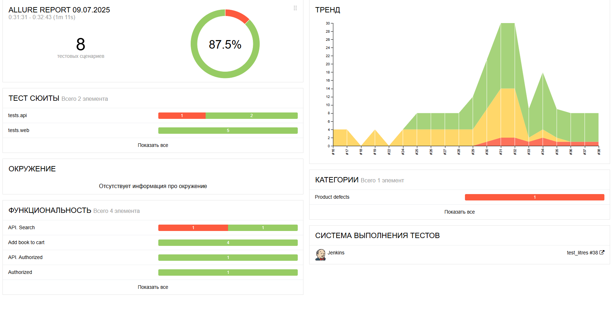
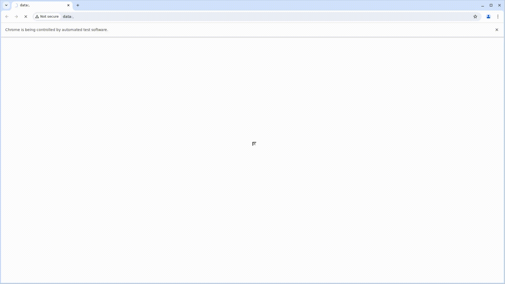

<h1> Проект по тестированию сервиса электронных и аудиокниг "Литрес"</h1>

> <a target="_blank" href="https://www.litres.ru">Ссылка на сайт</a>


<h3> Список проверок, реализованных в автотестах:</h3>

### UI-тесты
- [x] Поиск книги
- [x] Добавление книги в корзину
- [x] Добавление книги в Избранное
- [x] Удаление книги из Избранного

### API-тесты
- [x] Поиск книги
- [x] Добавление книги в корзину
- [x] Проверка каталога с сертификатами

----
### Проект реализован с использованием:
         

----
### Локальный запуск
> Для локального запуска с дефолтными значениями необходимо выполнить команду:
```
python -m venv .venv
source .venv/bin/activate
pip install poetry
poetry install --no-root
pytest tests
```

----
### Удаленный запуск автотестов выполняется на сервере Jenkins
> <a target="_blank" href="https://jenkins.autotests.cloud/job/test_litres/">Ссылка на проект в Jenkins</a>


#### Для запуска автотестов в Jenkins

1. Открыть <a target="_blank" href="https://jenkins.autotests.cloud/job/test_litres/">проект</a>
2. Выбрать пункт `Build with Parameters`
3. Результат запуска сборки можно посмотреть в отчёте Allure

----
### Allure отчет


#### Общие результаты

#### Список тест кейсов

#### Пример отчета о прохождении ui-теста

#### Пример отчета о прохождении api-теста


## [Видео прохождения автотестов](https://jenkins.autotests.cloud/job/test_litres/38/allure/data/attachments/65715dbcedac12d8.html)

